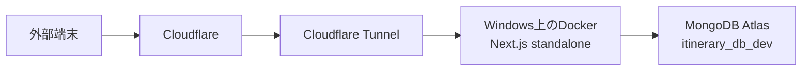

# 自宅ミニPCへのセルフホスト PoC

Vercel Hobby の無料枠超過が続く見込みのため、Vercel 部分を自宅ミニPC（未購入）へ移す案を、
先に Windows 開発PC 上の Docker で検証する。作業ブランチは `self-host-poc`（ローカルのみ）。

> 接続文字列・トークン等の**値は書かない**。どの環境変数に何を入れるかだけを記録する。

## 目的と判断基準

次が全部通ったら、ミニPC購入へ進む。

- [x] 主要機能が Docker 内で動作する（トップ・地図・スポット詳細・旅程・管理画面）
- [ ] ログイン後の画面・旅程・AI 生成を含めた並列アクセスで異常がない（DB を使わないページのみ確認済み）
- [x] Auth0 のログイン／コールバック／ログアウトが正常に戻る（localhost・staging とも）
- [x] ISR と管理画面からの更新（`revalidateTag` / `updateTag`）が整合する
- [x] Windows 再起動後に自動で復旧する（サインイン後）
- [x] Cloudflare Tunnel 経由の速度に問題がない（NRT 経由で本番と同等以上）
- [ ] 数日間の連続運転で落ちない → **ミニPC購入後、本番を切り替える前に行う**（下記「今後の進め方」）

## 構成



- ルーターのポート開放はしない。コンテナは `127.0.0.1:3000` にだけ公開する
- DB は PoC の間 **`itinerary_db_dev`** を使う（本番 `itinerary_db` には触れない）

### 前提として分かっていること

- `next start` のメモリ実測（2026-09-14）: 待機 約330MB、負荷時 最大 約640MB、ビルド 最大 約1GB
- Next 16.2.10 は Linux ビルドでトップ `/` が 500（React Client Manifest から `PublicHome` が欠落）。16.3.5 で解消済み（Netlify 試験で確認）
- `NEXT_PUBLIC_*` と `next.config.mjs` の評価はビルド時。`env_file` だけでは足りず build args が必要
- `VERCEL_ENV` に依存している箇所がある（Vercel 外では未定義になる）
  - `sentry.server.config.ts` / `sentry.edge.config.ts`: `production` のときだけ Sentry 有効
  - `next.config.mjs`: CSP レポートの環境名、`vercel.live` の許可
- standalone 出力には `public/` と `.next/static` が含まれない。PWA の `sw.js` は `public/` に出る

### 外部サービス側で必要な設定（テスト用サブドメイン決定後）

- Auth0: Allowed Callback URLs / Logout URLs / Web Origins に追加（Vercel の URL は消さない）
- `APP_BASE_URL` をテスト用 URL に
- Mapbox ブラウザ用トークンの URL restrictions に追加
- MongoDB Atlas の IP アクセスリストを確認
- Cloudflare Tunnel: `over40web.club` の DNS を Squarespace から Cloudflare へ移す（手順3を参照）

## 進捗

- [x] 0. 準備（ブランチ作成、`.dockerignore` 修正、Next 16.3.5 へ更新）
- [x] 1. Docker でビルド・起動
- [x] 2. コンテナ停止・再起動、Windows 再起動からの復旧
- [x] 3. Cloudflare Tunnel（接続済み。当初は PDX 経由で遅かったが、昼には NRT に変わり本番と同等以上）
- [x] 4. Auth0（staging でログイン・ログアウトを確認）
- [ ] 5. 並列アクセス試験（DB を使わないページは完了。DB を使うページは方法を保留中）
- [x] 6. 障害復旧の練習（DB 接続不可・トンネル再起動・アプリ再起動・切り戻し・回線断）
- [-] 7. 数日間の連続運転（開発PCでは行わない。ミニPC購入後、本番切り替え前に行う）

## 作業ログ

### 2026-09-16

- ブランチ `self-host-poc` を作成（push しない。push すると Vercel のプレビュービルドが走るため）
- `next` / `eslint-config-next` を 16.2.10 → 16.3.5 に更新
- `.dockerignore` を修正
  - `.env*` を除外（それまでは `.env.local` がイメージに入る状態だった）
  - `.next/` を除外（開発サーバーのビルド結果が混ざるのを防ぐ）
  - `tmp/` `backups/`（本番データのダンプ）`dist/` `docs/` を除外
- 更新後の確認（Windows 上）: `tsc --noEmit` OK、`pnpm lint` エラー 0（警告 9）、`pnpm build` 成功
  - 警告のうち5件は 16.3 で入った `@next/next/no-location-assign-relative-destination`（`window.location.href` での内部遷移）。
    3件は `/auth/login`・`/auth/logout` への遷移で、Auth0 のルートには全画面遷移が必要。
    残り2件は変数に入った URL（ナビアプリ起動用）への遷移。いずれも今回は直さない
- 既存の `Dockerfile` / `docker-compose.yml` は npm 前提の開発用で、`package-lock.json` が無いためビルドできなかった → 下記で作り直した

#### 手順1: Docker でビルド・起動

環境: Docker Desktop（Engine 29.8.0、WSL2、割り当て 16GB / 24コア）

作ったもの:

- `Dockerfile`: deps → builder → runner の3段構成。`node:22.17.0-bookworm-slim`、pnpm 10.19.0
  - 環境変数ファイルは BuildKit の secret としてビルド中だけマウントし、`.env.production.local` として読ませる
    （`NEXT_PUBLIC_*`・`next.config.mjs`・`generateStaticParams` がビルド時に値を必要とするため）
  - **Next は読み込んだ `.env*` を `.next/standalone` へコピーする**ので、ビルド直後に削除している
  - 非 root（`node` ユーザー）で実行。`/api/health` をヘルスチェックに使う
- `compose.yaml`: `127.0.0.1:3000` だけに公開、`restart: unless-stopped`、`init: true`
  - 旧 `docker-compose.yml` は削除（両方あると compose が警告を出すため）
- `next.config.mjs`: `BUILD_STANDALONE=1` のときだけ `output: 'standalone'`（Vercel のビルドは変わらない）
- `.env.docker`（Git 管理外）: `.env.local` の複製から次を除いたもの
  - `NEXT_PUBLIC_POSTHOG_KEY` / `POSTHOG_*`: 本番ビルドだと計測が有効になり、試験のアクセスが混ざるため
  - `SENTRY_AUTH_TOKEN`: ビルドのたびに本番の Sentry プロジェクトへソースマップが上がるため
  - DB は `APP_MONGODB_URI` / `MONGODB_URI` とも `itinerary_db_dev` であることを確認済み
  - `APP_BASE_URL` は `http://localhost:3000` のまま（開発用の Auth0 設定がそのまま使える）

使い方:

```bash
docker compose build     # 約1分50秒（うち next build 約90秒）
docker compose up -d
docker compose logs -f app
docker compose down
```

> ポート 3000 を使うので、コンテナ起動中は `pnpm dev` を起動できない。開発に戻るときは `docker compose down`。

結果:

- ビルド成功。イメージ 374MB。イメージ内に `.env*` が残っていないことを確認
- 起動直後にヘルスチェック healthy、待機時メモリ 約140MB
- **トップ `/` は 200**（16.2.10 で出ていた Linux ビルドの 500 は再現せず）
- 200 を確認: `/`・`/shachu-haku`・スポット詳細・`/shachu-haku/shindan`・`/itineraries`・旅程詳細・`/itineraries/new`・
  `/help`・`/updates`・`/sitemap.xml`・`/robots.txt`・`/sw.js`・`/manifest.json`・`/offline.html`・`/api/camping-spots`
- `/auth/login` は Auth0 へ 307（`redirect_uri=http://localhost:3000/auth/callback`）、`/admin` は未ログインでリダイレクト
- CSP ヘッダーは出ている。ただし `VERCEL_ENV` が無いので、レポートの環境名が `development`、`vercel.live` の許可も入っている（想定どおり）
- `/monitoring`（Sentry tunnel）への GET は 404。POST 専用のため問題なし
- ビルド時の警告は、Sentry の設定項目の非推奨（`disableLogger` など）と Auth0 SDK の `Critical dependency` のみ。Vercel でも出ている既存のもの

ブラウザでの確認:

- [x] 地図の表示
- [x] ログイン → コールバック → ログアウト
- [x] 管理画面での更新が、一覧・詳細に反映される（ISR / `revalidateTag`）
- [x] PWA: `sw.js` が activated / running、Scope `http://localhost:3000/`、Cache storage にキャッシュが作られる
- [x] オフライン時の表示（Docker 固有の問題なし）: `/admin/shachu-haku/<id>` をオフラインで開くと Chrome の恐竜画面になる（ユーザー確認）
  - **Docker 固有ではない見込み**: コンテナの `sw.js` と本番（tabi.over40web.club）の `sw.js` は、ルート構成（cacheName の並び）が同一
  - Playwright（headless Chromium）での再現は不安定。新しいタブで開くと `offline.html` が返る回数と、
    `ERR_INTERNET_DISCONNECTED` になる回数の両方がある。Playwright の `setOffline` は Service Worker からの通信を
    確実には止めないようで（オフラインのはずが 404 がサーバーから返った）、未ログインの `/admin` が 307 → `/auth/login` へ
    転送されてエラーになった可能性がある。実ブラウザでの原因は未特定
  - **本番でも恐竜画面が出た**（トップでオフラインにして、車中泊ページへ遷移。手順は少し違う）
    → Docker 固有ではなく既存の PWA の課題。PoC とは別に扱い、手順1の判定からは外す
- 別件で分かったこと: **`next.config.mjs` の `runtimeCaching` が効いていない**
  - `@ducanh2912/next-pwa` v10 では `workboxOptions.runtimeCaching` に書く必要があるが、トップレベルに書いている
  - 本番の `sw.js` にも、設定したはずの Mapbox 用キャッシュ（`mapbox-static-assets` など）が無く、
    ライブラリ既定のキャッシュ（`pages`・`apis`・`cross-origin` など）だけが入っている
  - PoC とは別の課題として扱う

#### 手順2: 停止・再起動からの復旧

| 試験 | 結果 |
| --- | --- |
| `docker compose down` → `up -d` | 約6秒で healthy、`/` 200 |
| `docker compose stop` → `start` | 停止は約0.2秒（SIGTERM で正常終了）、約6秒で復旧 |
| コンテナ内で Next のプロセスを SIGKILL（クラッシュ相当） | **自動で再起動**（RestartCount 1）、約4秒で `/` 200 |
| `docker kill` | 再起動**しない**。Docker の仕様で、手動停止扱いになり再起動ポリシーが働かない。`docker compose up -d` で戻す |

注意:

- `init: true` により PID 1 は `docker-init`、Next は子プロセス（`next-server`）。子が落ちるとコンテナごと終了し、再起動ポリシーが働く
- **ヘルスチェックが unhealthy になっても、素の Docker はコンテナを再起動しない**（Swarm のみ）。
  プロセスが生きたまま応答しなくなる（ハングする）場合は復旧しない。ミニPCでは autoheal 系のコンテナか、
  cron / systemd timer での監視を検討する
- イメージに `kill` や `ps` が無い（slim イメージ）。調査は `docker exec ... node -e` で行う

残り（ユーザーが実施）:

- [x] Docker Desktop を終了 → 起動して、コンテナが自動で戻る
- [x] Windows を再起動して戻る（サインイン後）
  - Docker Desktop は**Windows にサインインしないと起動しない**。「Start Docker Desktop when you sign in」の設定も必要。
    ミニPC（Ubuntu + Docker Engine）では systemd で起動するので、この制約はない

#### 手順3: Cloudflare Tunnel（準備: DNS を Cloudflare へ移す）

方式の検討: Tunnel の公開ホスト名は Cloudflare 管理のゾーンにしか作れない。候補は
Quick Tunnel（ランダムURL）・DNS 移管・別ドメイン取得・Tailscale Funnel。
**本番移行でも必要になるので、`over40web.club` の DNS を Cloudflare へ移す**ことにした（ユーザー判断）。
ドメインの登録先は Squarespace のまま、ネームサーバーだけを変える。

現在のネームサーバー: `ns-cloud-a1〜a4.googledomains.com`（旧 Google Domains → Squarespace）

公開 DNS から見えたレコード（2026-09-16、dns.google で調査。**これで全部とは限らない**）:

| 名前 | 種類 | 値 | 用途（推定） |
| --- | --- | --- | --- |
| `over40web.club` | A | `75.2.60.5` | Netlify（apex） |
| `www` | CNAME | `over40webclub-astro.netlify.app` | Netlify の Astro サイト |
| `tabi` | CNAME | `cname.vercel-dns.com` | 本番アプリ（Vercel） |
| `over40web.club` | MX | `10 mxa.mailgun.org` / `10 mxb.mailgun.org` | Mailgun（受信） |
| `over40web.club` | TXT | `v=spf1 include:mailgun.org include:_spf.mailersend.net ~all` | SPF |
| `_dmarc` | TXT | `v=DMARC1; p=none;` | DMARC |
| `pic._domainkey` | TXT | DKIM 公開鍵 | Mailgun の DKIM |
| `resend._domainkey` | TXT | DKIM 公開鍵 | Resend の DKIM |
| `send` | MX | `10 feedback-smtp.ap-northeast-1.amazonses.com` | Resend（送信の戻り） |
| `send` | TXT | `v=spf1 include:amazonses.com ~all` | Resend の SPF |

Squarespace の DNS 画面で確認した追加分（ユーザー確認。値は dns.google で調査）:

| 名前 | 種類 | 値 | 用途・重要度 |
| --- | --- | --- | --- |
| `movie` | CNAME | `pitang-movie-list.netlify.app` | Netlify のサイト（重要） |
| `naotta` | CNAME | `naotta-memo.pages.dev` | Cloudflare Pages のサイト（重要） |
| `property-locator` | CNAME | `property-locator-o40.netlify.app` | Netlify のサイト（重要） |
| `tate-tweet` | CNAME | `tate-tweet.netlify.app` | Netlify のサイト（重要） |
| `contact` | CNAME | `cname.vercel-dns.com` | Vercel（重要度低） |
| `fmlknbcbth4q` | CNAME | `gv-….dv.googlehosted.com` | Google のドメイン所有確認 |
| `rt6v5ht4klow` | CNAME | `gv-….dv.googlehosted.com` | Google のドメイン所有確認 |
| `@` | TXT | MailerSend の確認用（ユーザー申告） | 使用状況不明 |
| `shiratama` | **A** | `162.43.120.110` | nginx のサイト（重要）。IP の範囲からレンタルサーバー（Xserver 系）と推定 |

- 棚卸しは上の2つの表で全部（ユーザー確認済み。MX は Mailgun の2件のみ）
- Cloudflare で **Email Routing を有効にしない**（MX を Cloudflare のものに書き換えるため、Mailgun の受信が止まる）
- 重要度が低いものも含め、**切り替え時は全部そのまま写す**。整理（削除）は切り替えが落ち着いてから別作業で行い、原因の切り分けを楽にする
- MailerSend: コードは `4eeb993`（MailerSend → Resend へ移行）以降使っていない。SPF の `include:_spf.mailersend.net` と
  `@` の確認用 TXT は不要な可能性が高いが、上記の理由で後回し
- **DNSSEC が有効**（dns.google の応答が `AD: true`）。ネームサーバー変更の前に Squarespace で無効化し、
  DS レコードが消えるのを待つ必要がある（DS の TTL は 3600 秒。消えてから**さらに1時間以上**置いて NS を変える）。
  Cloudflare で Active になったら、Cloudflare 側で DNSSEC を有効にし、表示される DS を Squarespace に登録し直す

手順（ユーザーがダッシュボードで実施）:

1. **Squarespace の DNS 画面で全レコードを確認**し、上の表に無いものを控える（任意の名前のサブドメインや、サービスの所有確認用 TXT は外からは見つけられない）
2. Squarespace で **DNSSEC が有効なら先に無効化**する（有効なままネームサーバーを変えると名前解決できなくなる）
3. Cloudflare（Free プラン）で `over40web.club` を追加 → 自動スキャンの結果を 1. と突き合わせ、足りないものを手で追加
   - **すべて「DNS only」（灰色の雲）にする**。Vercel・Netlify の前に Cloudflare のプロキシを挟むと、証明書の発行や
     キャッシュで問題が出やすい。プロキシ（橙色）にするのは、あとで作る Tunnel のホスト名だけ
   - MX・DKIM の TXT は値を一字一句そのまま写す
4. Squarespace でネームサーバーを Cloudflare が指定する2つに変更
5. Cloudflare でゾーンが「Active」になるのを待つ（数分〜最大24時間程度）
6. 切り替え後の確認: `tabi.over40web.club`・`www`・apex が表示される／メールの送受信（Resend の認証メールなど）

経過:

- 2026-09-16 深夜: Squarespace で DNSSEC を無効化（Squarespace の表示では反映に最大48時間）。
  23:58 時点では、DS レコードは dns.google・1.1.1.1 のどちらにもまだ残っている（レジストリへの反映待ち）
- 2026-09-17 00:24: **.club のレジストリ（a/b.nic.club、ns1.dns.nic.club）から DS が消えた**ことを `dig +norec` で確認。
  1.1.1.1 も DS なし。dns.google はキャッシュが残り TTL 1982 秒。DS の TTL は 3600 秒なので、**01:30 以降なら NS を変更してよい**
- Cloudflare にゾーンを追加（Free）。レコードは全20件、すべて DNS のみ（`_domainconnect` は自動取り込みで追加されたもの）
- 割り当てられたネームサーバー: **`autumn.ns.cloudflare.com` / `rodney.ns.cloudflare.com`**（同じアカウントの `nafuda.me` と同じ）
- 01:19: 切り替え前の最終確認。Squarespace 側（`ns-cloud-a1`）と Cloudflare 側（`autumn`）に同じ問い合わせを直接投げ、
  **19種類の問い合わせすべてで応答が一致**。レジストリの NS はまだ Squarespace、主要リゾルバ（8.8.8.8 / 1.1.1.1 / 9.9.9.9）の DS はすべて空
- 01:30 過ぎ: Squarespace でネームサーバーを Cloudflare の2つに変更し、Cloudflare で「ネームサーバーを更新しました」を押した
- 01:36: レジストリの NS はまだ `ns-cloud-a*`（反映待ち）。旧ネームサーバーは引き続き同じ内容で応答しているので、切り替わるまでの間も止まらない
- 02:19: **Cloudflare から「アクティブになりました（Free プラン）」のメール**。確認結果:
  - レジストリの NS が `autumn` / `rodney` に変わり、DS なし
  - 8.8.8.8・1.1.1.1・208.67.222.222 は Cloudflare を参照。9.9.9.9 は旧 NS のキャッシュが残る（旧 NS も同じ内容で応答中なので問題なし）
  - 公開リゾルバ経由で apex / www / tabi / shiratama / naotta / MX / Resend DKIM の値が切り替え前と同じ
  - HTTPS で9サイトすべて 200（apex・www・tabi・movie・naotta・property-locator・tate-tweet・shiratama・contact）
  - 残り: メールの送受信、Cloudflare Pages での `naotta` の状態（ユーザー確認）、DNSSEC の再有効化
  - [x] 送信（Resend）: お問い合わせフォームのメールが googlegroups.com 経由でサポート用グループに届いた（ユーザー確認）
  - 受信: **使っていない**（メールは送信専用、ユーザー確認）。Mailgun の MX・SPF・DKIM は後の整理の候補
  - `naotta`: `https://naotta.over40web.club/` と `https://naotta-memo.pages.dev/` の中身が一致。
    `naotta.over40web.club` 用の証明書（Google Trust Services、2026-11-18 まで）が出ている。
    Cloudflare Pages の Custom domains でも Active のまま（ユーザー確認）

- 02:30 頃: Cloudflare で DNSSEC を有効化し、DS を Squarespace に登録（ユーザー実施）。
  02:32 時点で Cloudflare は DNSKEY（アルゴリズム 13）を返しているが、レジストリにはまだ DS が無い（反映待ち）
  - **次回最初に確認**: `dig +norec DS over40web.club @a.nic.club` に DS が出ること、1.1.1.1 の応答に `ad` フラグが付くこと、
    Cloudflare の DNSSEC 欄が「成功」になっていること。DS が出た後に名前解決が SERVFAIL になったら、DS の値の入力ミスを疑う

- 2026-09-17 10:36: **DNSSEC 有効化を確認**。レジストリに DS（キータグ 2371、アルゴリズム 13、ダイジェストタイプ 2）が出ており、
  `delv @1.1.1.1 over40web.club A` が `fully validated`。
  （`tabi` などの CNAME は、転送先の vercel-dns.com などが未署名なので、応答に `ad` フラグは付かない。これは正常）
- **DNS の Cloudflare 移行はこれで完了**

切り替え後にやること（こちらで準備）:

- Cloudflare Zero Trust で名前付きトンネルを作成し、`cloudflared` を `compose.yaml` にサービスとして追加する
  （ミニPCでも同じ構成で動かせるように、Windows へのインストールではなくコンテナにする）
- 公開ホスト名 `staging.over40web.club` → `http://app:3000`

2026-09-17 準備済み（DS レコードが消えるのを待つ間に実施）:

- `compose.yaml` に `tunnel` サービスを追加（`cloudflare/cloudflared:2026.9.1`、profile `tunnel`）
  - 起動: `docker compose --profile tunnel up -d`（profile を付けなければ従来どおり app だけ起動）
  - トークンは `.env.tunnel`（Git 管理外）に `TUNNEL_TOKEN=...` として置く
  - app が healthy になってから起動する。転送先はコンテナ名で `http://app:3000`
- 手順4 向けの調査: Auth0 SDK（v4.28）は `APP_BASE_URL` にカンマ区切りで複数の URL を書ける。
  その場合はリクエストの `x-forwarded-host` / `host` から URL を推定し、一覧に含まれるかを確かめる。
  → `APP_BASE_URL=http://localhost:3000,https://staging.over40web.club` の形で両方を使える見込み
- 2026-09-17: `.env.docker` の `APP_BASE_URL` を上の形に変更し、コンテナを作り直して確認（トンネルは未接続なのでヘッダーを付けて模擬）
  - localhost からの `/auth/login` → `redirect_uri=http://localhost:3000/auth/callback`
  - `Host: staging.over40web.club` と `X-Forwarded-Proto: https` を付けると → `redirect_uri=https://staging.over40web.club/auth/callback`
  - 一覧に無いホスト（`Host: evil.example.com`）は 500（`InvalidConfigurationError`）で拒否される。想定どおり
  - `/`・`/shachu-haku`・`/api/health` 200、`/admin` 307 で他に影響なし
  - `APP_BASE_URL` は実行時にだけ読まれるので、変更は `docker compose up -d`（作り直し）で反映され、再ビルドは不要

#### 手順3: トンネルの接続（2026-09-17）

- Zero Trust（Free）でトンネル **`home-server-1`** を作成（ユーザー実施）。機械の名前にしたのは、ミニPCで他のアプリも
  公開する可能性があるため。ミニPCへ移るときは `.env.tunnel` を移すだけで同じトンネルが使える（2台同時に動かすと振り分けられるので注意）
- 公開ホスト名: `staging.over40web.club` → `http://app:3000`（Cloudflare 側に DNS レコードが自動作成される）
- `docker compose --profile tunnel up -d` で起動
  - 事前チェック（DNS・QUIC・HTTP/2・API）すべて PASS、QUIC で4本の接続が東京（nrt01 / nrt10 / nrt16）に確立
  - ダッシュボードから配られた設定: `staging.over40web.club` → `http://app:3000`、それ以外は 404

外部（Cloudflare 経由）からの確認:

- `/`・`/shachu-haku`・スポット詳細・`/itineraries`・旅程詳細・`/sw.js`・`/api/camping-spots`・`/robots.txt` 200、`/admin` 307
- **実際のトンネル経由でも** `/auth/login` の戻り先が `https://staging.over40web.club/auth/callback` になる
  （Cloudflare が付けるヘッダーで、Auth0 SDK が staging の URL を正しく推定している）

**速度（開発PCから計測、要注意）**:

| 対象 | 接続 | 最初の1バイト（TTFB） | 応答した Cloudflare 拠点 |
| --- | --- | --- | --- |
| 本番 Vercel `tabi/api/health` | 約15〜25ms | 約0.09〜0.2秒 | — |
| staging（トンネル）`/api/health` | 約100〜130ms | **約0.43〜0.5秒** | **PDX（米ポートランド）** |
| Cloudflare Pages `naotta` | — | — | HKG（香港） |
| 参考: localhost 直接 | — | 約0.01秒 | — |

- 自宅回線から staging にアクセスすると、Cloudflare の**米国の拠点（PDX）**に着き、そこからトンネルの東京拠点へ戻ってくる。
  このため、アプリの処理がほぼ無い `/api/health` でも 0.4 秒以上かかる
- Cloudflare の無料プランは、日本の一部の回線だと国外の拠点へ振り分けられることがある、と言われている。
  同じ回線からの `cloudflare.com` は HKG だったので、拠点はドメインやプランによって変わるらしい（原因は未確認）
- 判断基準「Tunnel 経由の速度に問題がない」に直結する。**別の回線（スマートフォンのモバイル回線など）からも測る**。
  拠点は `https://staging.over40web.club/cdn-cgi/trace` の `colo=` で確認できる

#### 手順4: Auth0（2026-09-17）

- Mapbox のブラウザ用トークンの URL 制限と、Auth0 の Callback / Logout / Web Origins に staging の URL を追加（ユーザー実施）
- 携帯回線からも `colo=PDX`（ユーザー確認）。**自宅の固定回線に限らず、国外の拠点を経由している**
- **staging でログインすると Internal Server Error**
  - 原因: `src/lib/auth0.ts` の `onCallback` が `new URL(..., process.env.APP_BASE_URL)` としており、
    カンマ区切りの `APP_BASE_URL` を URL として解釈できず `TypeError: Invalid URL` になる。
    続く `invalid_grant` は、同じ認可コードを再び使おうとしたことによる二次的なエラー
  - 修正:
    - `src/lib/appBaseUrl.ts` を追加（`getPrimaryAppBaseUrl()`: カンマ区切りの先頭を返す）
    - `onCallback` は SDK がリクエストから解決した `context.appBaseUrl` を使い、取れないときだけ先頭の値に戻す
    - `src/lib/resend.ts` の通報メール内リンクも同じ理由で壊れるので、`getPrimaryAppBaseUrl()` を使う
    - Vercel は `APP_BASE_URL` が1つだけなので、挙動は変わらない
  - `tsc` OK、`pnpm lint` エラー 0。再ビルド後、staging の `/auth/login` の戻り先は staging のまま
  - 既知の制限: state 不一致などのエラー経路では SDK が `context` を空で渡すため、staging からでも
    `http://localhost:3000/` へ戻される（`APP_BASE_URL` の先頭）。PoC では許容。本番は URL が1つなので起きない

#### 速度の再計測（2026-09-17 昼）

- 「PC では遅く感じない」（ユーザー）を受けて再計測したところ、**拠点が NRT（東京）に変わっていた**（ブラウザ・curl とも）
  - `/api/health` の TTFB: curl で約 0.05〜0.08 秒（午前は PDX 経由で約 0.45 秒）。ブラウザは HTTP/3 で約 0.025 秒
  - 午前に PDX だった理由は未確認。ゾーンの有効化やホスト名の作成の直後だったので、Cloudflare 側の経路が落ち着くまでの一時的なものだった可能性がある
- ヘッドレス Chromium で、本番（Vercel）と staging を比較（各5回の中央値、単位 ms、Service Worker は無効、開発PCの固定回線から）

| ページ | 対象 | TTFB | FCP / LCP | load | TTFB（2回目） | load（2回目） |
| --- | --- | --- | --- | --- | --- | --- |
| `/` | Vercel | 52 | 492 | 478 | 13 | 235 |
| `/` | staging | 77 | 252 | 293 | 32 | 71 |
| `/shachu-haku` | Vercel | 49 | 348 | 438 | 13 | 222 |
| `/shachu-haku` | staging | 69 | 176 | 233 | 33 | 71 |
| `/itineraries` | Vercel | 52 | 388 | 453 | 13 | 273 |
| `/itineraries` | staging | 83 | 192 | 264 | 58 | 100 |
| `/help` | Vercel | 54 | 328 | 373 | 13 | 150 |
| `/help` | staging | 58 | 188 | 245 | 26 | 59 |

- 読み方の注意（**staging が速く見えるのは公平な比較ではない**）
  - TTFB（最初の1バイト）は Vercel が 20〜30ms 速い。Vercel は CDN のキャッシュから返し、staging は毎回自宅のPCまで往復するため
  - FCP・load は staging が速いが、staging は PostHog のキーを外しており計測スクリプトが無い。
    データも開発用 DB（件数が違う）。開発PCと staging が同じ家にあり、地理的にも有利
  - 地図タイル（Mapbox）などの外部通信は含まれるが、ページの操作はしていない
- 携帯回線でも `colo=NRT` に変わったことを確認（ユーザー確認）。午前の PDX は、回線を問わない一時的なものだったと見られる
- 判断: **現時点で、トンネル経由の速度は本番と同等以上**。PDX 経由に戻ることがないか、数日間の運転（手順7、ミニPCで実施）の中で
  `cdn-cgi/trace` の `colo` を定期的に記録して確かめる

#### staging のアクセス制限（Cloudflare Access、2026-09-17）

- Zero Trust の Access で、セルフホストのアプリケーション（宛先: 公開ホスト名 `staging.over40web.club`、パス空欄）を作成し、
  「自分のメールアドレスだけ Allow」のポリシーを結び付けた（ユーザー実施）。ログイン方法はワンタイム PIN
  - つまずき: **ポリシーを作っただけでは何も守られない**。アプリケーション（守るホスト名）を作ってポリシーを結び付ける必要がある
  - 保存から全拠点に反映されるまで約1分。途中は 200 と 302 が混ざった
- 確認: `/`・`/api/health`・`/auth/callback`・`/sw.js` がすべて `https://<チーム名>.cloudflareaccess.com/` への 302。本番 `tabi` は 200 のまま
  - チーム名は自動で付いた `soft-smoke-c9dc`（Zero Trust の設定で変更できる）
- 影響: curl や負荷試験ツールは門番を通れない。外から自動で試すときは、Access のサービストークン
  （`CF-Access-Client-Id` / `CF-Access-Client-Secret` ヘッダー）を使う

サービストークン（2026-09-17）:

- サービストークン `claude-poc` を作成し、値を `.env.access`（Git 管理外）に保存（ユーザー実施）
  - Client Secret は **2026-08-26 以降 `cfast_` ＋ 英数字48文字（合計54文字）** の新形式。以前の「64文字の16進数」ではない
  - `.env.access` は CRLF で保存されていたので、シェルで読むときは `tr -d '\r'` で改行文字を除く
- 再利用可能なポリシー「サービストークンで許可」（アクション **Service Auth**、ルール **Service Token** → `claude-poc`）を作成し、
  staging のアプリケーションに追加して保存
  - つまずき: ルールの初期値「任意の Access Service Token」は、アカウント内の有効なトークンすべてを通すので、個別指定に変えた
  - つまずき: ポリシーを作っただけでは「アプリケーションによって使用される」が 0 のまま。アプリケーションの「既存のポリシーを追加」で結び付けて保存する
- 確認: トークンありで `/api/health`・`/`・`/shachu-haku` が 200、`/auth/login` は 307（Auth0 へ）、拠点は NRT。
  トークンなし・誤った Secret はどちらも 302（ログイン画面へ）

#### 手順5: 並列アクセス試験（2026-09-17、その1: DB をほぼ使わないページ）

前提:

- 開発PC: Intel Core i9-12900KF（16コア / 24スレッド）、メモリ 32GB。Docker Desktop に 16GB / 24コアを割り当て
- ツール: autocannon 8.0.0。各条件 10 秒。対象は `/api/health`・`/help`（静的）・スポット詳細（ISR でキャッシュ済み）
- **開発用 DB（`itinerary_db_dev`）と本番 DB（`itinerary_db`）は同じ Atlas クラスタ（`cluster0`）にある**。
  DB を使うページに高負荷をかけると本番に影響しうるので、その1では DB を使わないページに限った

分かったこと 1: **Windows → Docker のポート転送が詰まる**

- Windows 側から `127.0.0.1:3000` に負荷をかけると、どの条件でも p99 が約 2000ms、処理量も 160〜240 件/秒にとどまった（CPU はほぼ空き）
- Docker の内部ネットワーク（`tns-web_default`）から `http://app:3000` に直接かけると、2秒の詰まりは消え、処理量は 4〜6 倍になった
- → Docker Desktop（Windows）のポート転送の問題。**トンネルは内部ネットワークで `app:3000` につながるので影響を受けない**。
  ミニPC（Linux の Docker Engine）ではこの経路自体が無い。以降の計測は内部ネットワークから行う

分かったこと 2: **Next のサーバーは実質1コアで動く**（内部ネットワークから計測、処理量は件/秒、遅延は ms）

| CPU 制限 | ページ | c=1 処理量 / p99 | c=12 処理量 / p99 | c=50 処理量 / p50 / p99 |
| --- | --- | --- | --- | --- |
| なし | `/api/health` | 961 / 2 | 958 / 16 | 956 / 51 / 66 |
| なし | `/help` | 640 / 3 | 706 / 34 | 720 / 67 / 132 |
| なし | スポット詳細 | 570 / 3 | 617 / 39 | 623 / 78 / 154 |
| 1コア | `/api/health` | 902 / 3 | 920 / 20 | 902 / 53 / 99 |
| 1コア | `/help` | 634 / 3 | 677 / 36 | 680 / 70 / 164 |
| 1コア | スポット詳細 | 556 / 3 | 608 / 40 | 589 / 81 / 212 |
| 0.5コア | `/api/health` | 414 / 55 | 414 / 73 | 406 / 106 / 383 |
| 0.5コア | `/help` | 308 / 53 | 321 / 89 | 313 / 128 / 556 |
| 0.5コア | スポット詳細 | 259 / 53 | 266 / 98 | 275 / 184 / 722 |

- すべての条件でエラー 0、2xx 以外 0
- **制限なしと1コアの差は数%**。処理量はコア数ではなく**1コアあたりの性能**で決まる
- 0.5コア（1コアの性能が半分の CPU の目安）では、処理量がほぼ半分、遅延の上位が伸びる。
  それでも 1 秒あたり 250 件以上をエラーなく処理した
- 同時接続 50 では、各条件とも最大遅延が 1〜4 秒の外れ値を含む（負荷の立ち上がり時とみられる）
- 負荷後のメモリは約 690MiB まで増えた（9/14 の実測と同じく、GC が緩いためで上限はある）
- `docker update --cpus 0` では制限が外れなかったので、`docker compose up -d --force-recreate app` で作り直した

DB について（2026-09-17 ユーザー確認）:

- Atlas は **Free（M0）**: ストレージ 512MB、共有 CPU、**1秒あたり 100 操作まで**。開発用と本番は同じクラスタで DB 名だけが違う
- データ量は小さい（`itinerary_db_dev` 約2,000件、データ＋索引で約4MB）。Atlas 固有の機能（`$search`・Change Streams）は未使用で、
  `2dsphere` は通常の MongoDB でも使える
- 判断: **DB は当面 Atlas のまま**。自宅に移すと、バックアップ・障害時のデータ保全・アプリと DB の同時停止を自分で抱えることになる。
  上限の 100 操作/秒は、今のアクセス数では負荷試験のときくらいしか問題にならない
- 後で検討: 開発用 DB を別プロジェクトの無料クラスタへ分ける（本番の処理枠を開発で使わないように）
- **保留（ユーザー判断）**: DB を使うページの並列試験をどう行うか
  - 案2: `compose.yaml` にローカルの MongoDB を足し、開発用 DB を `mongodump` / `mongorestore` でコピーして試験（本番に影響なし、c=50 まで可）
  - 案3: Atlas のまま c=12 まで・短時間・閑散時間帯に試験（準備不要だが本番に影響しうる）

ミニPC への当てはめ（CPU の性能は公開ベンチマークからの目安で、実機では未確認）:

- 5万円前後のミニPC で多い Ryzen 7 7735HS / 8845HS 級は、1コアあたりの性能が i9-12900KF の 8〜9 割程度
  → 表の「1コア」と「0.5コア」の間で、「1コア」寄りの結果が見込める
- 2〜3万円台の Intel N100 / N150 級は、1コアあたりの性能が半分程度 → 「0.5コア」の結果が目安

#### 手順6: 障害復旧の練習（2026-09-17、その1: 回線断以外）

##### DB（Atlas）に接続できない場合

方法: 動いている staging とは別に、同じイメージのコンテナ `dbtest-app` を**外部に出られないネットワーク**（`docker network create --internal`）で起動。
`docker network connect / disconnect bridge` で外部通信を付けたり外したりしながら、同じネットワークの別コンテナから問い合わせた。
問い合わせる本数は数件なので、共有クラスタへの負荷は無視できる。

| 場面 | `/api/health`・`/help`・スポット詳細・`/shachu-haku` | `/api/camping-spots` | `/itineraries` |
| --- | --- | --- | --- |
| A. 外部通信なしで起動 | 200 | **500**（約0.4秒で失敗: SRV レコードが引けない） | 200 |
| B. 外部通信を戻した直後 | 200 | **200**（再起動なしで回復） | 200 |
| C. 接続済みの状態で外部通信を切る | 200 | **500**（1回目 約29秒、2回目以降 約10秒待ってから） | 200（ただし約29秒 → 約10秒かかる） |
| D. 再び戻した直後 | 200 | **200**（即回復） | 200 |

- どの場面でもコンテナは再起動しなかった（RestartCount 0）。**DB が戻れば、アプリは何もしなくても回復する**
  - 最初の接続に失敗しても、`src/lib/database.ts` が次のリクエストで接続をやり直す
  - 接続済みの後に切れた場合は、MongoDB ドライバーが自動で再接続する。待ち時間は `serverSelectionTimeoutMS: 10000` で決まる
- `/api/health` は DB を見ないので、DB 障害中も 200。ヘルスチェックで再起動がかかる仕組みを入れても、DB 障害で無駄に再起動しない（望ましい）
- `/itineraries` などのページは DB が無くても 200 を返す（エラー表示を出しているとみられる。中身は未確認）。
  DB が切れていると、接続を待つ 10〜29 秒のあいだ表示が止まる
- 気付き: `database.ts` の `maxPoolSize: 3` はサーバーレス向けの値。常駐サーバーで同時アクセスが増えると、DB 待ちの行列になりうる。
  DB を使うページの並列試験（保留中）で確かめる

試験中のつまずき（記録）:

- `docker run --env-file` は、compose と違って値を囲む引用符（`'...'`）を**取り除かない**。`.env.docker` をそのまま渡すと
  `APP_BASE_URL` などが壊れて全ページ 500 になった。引用符を外した一時ファイルを作って回避（試験後に削除）
- コンテナ名で問い合わせると Host が `dbtest-app:3000` になり、`APP_BASE_URL` の一覧に無いので Auth0 が拒否して 500。
  問い合わせ側で `Host: localhost:3000` を名乗って回避

##### トンネル・アプリの再起動

方法: 外部から Access のサービストークン付きで `https://staging.over40web.club/api/health` に 0.5 秒おきにアクセスし、状態の変化を記録。

| 操作 | 外から見えた状態 | 止まった時間 |
| --- | --- | --- |
| `docker compose restart tunnel` | 502 → 530 → 200 | **約1.1秒** |
| `docker compose restart app`（トンネルはそのまま） | 502 → 200 | **約0.6秒** |
| `docker compose stop tunnel` → 20秒後に `start` | 502 → 530（停止中ずっと） → 200 | 停止中＋約1秒 |

- 502: トンネルはつながっているが、その先のアプリ（または接続の切り替え中）に届かない
- 530: Cloudflare から見てトンネルのコネクターが1つも無い（Cloudflare のエラー 1033 系）
- どちらも再起動すれば、数秒以内に自動で戻る。トンネルの再起動ポリシーは `unless-stopped`

##### 壊れた版を出してしまった場合の切り戻し

準備: `compose.yaml` の `image` を `tns-web:${APP_IMAGE_TAG:-local}` に変更し、版（タグ）で切り替えられるようにした。

```bash
APP_IMAGE_TAG=$(git rev-parse --short HEAD) docker compose build   # 版を付けてビルド
APP_IMAGE_TAG=<戻したい版> docker compose up -d app                 # 切り戻し
docker compose up -d app                                            # 通常（local）に戻す
```

練習: 今のイメージに `tns-web:08c1c4d` のタグを付けて保存。起動するとすぐ終了する壊れた版（`tns-web:broken`）を作って出し、元に戻した。

- 壊れた版を出すと、コンテナは再起動を繰り返す（20秒で8回）。外からは タイムアウト → 502 に見えた
- `APP_IMAGE_TAG=08c1c4d docker compose up -d app` で切り戻すと、**約1秒で 200 に戻った**
- 壊れた版を出してから切り戻すまでの停止は約17秒（切り戻しを打つまでの時間がほとんど）
- 後片付け: `docker compose up -d app` で `local` に戻し、`tns-web:broken` は削除。`tns-web:08c1c4d` は見本として残した
- 課題: 壊れた版は**出した時点では気付けない**（`up -d` は成功扱い）。ミニPCでは、出した後に healthy になるまで待ち、
  ならなければ前の版へ自動で戻すデプロイ用スクリプトを用意したい

##### 回線断（2026-09-17 21:41 頃、ユーザーが回線を約30秒切って戻した）

方法: 開発PC上で、サービストークン付きの外部アクセス（0.5秒おき）をバックグラウンドで記録しつつ、トンネルのログを確認。
回線を切っている間は、記録している開発PC自身も外に出られないので、「外の利用者から見た状態」は測れていない（その間は 530 と推定）。

| 時刻（UTC） | 出来事 |
| --- | --- |
| 12:41:35 | トンネルが通信断を検知（`timeout: no recent network activity`）。4本の接続が再接続を試み始める |
| 12:41:35〜 | 開発PCからのアクセスはタイムアウト → 名前解決の失敗（`ENOTFOUND`） |
| 12:42:19 | 回線が戻り、開発PCから Cloudflare に届くようになる。トンネルがまだつながっていないので **530** |
| 12:42:29 | 1本目の接続が再登録（nrt09） |
| 12:42:30 | **外からのアクセスが 200 に戻る**（回線復旧から約11秒） |
| 12:43:16〜17 | 残り3本も再登録（待ち時間が延びる仕組みのため、約47秒遅れ） |

- **回線が戻れば、何もしなくてもトンネルは自動でつなぎ直す**。コンテナの再起動も不要（アプリ・トンネルとも再起動なし）
- 1本つながった時点で配信は再開する。4本そろうまでの約47秒は冗長性が下がっているだけ
- 回線を切っていた間（約45秒）＋再接続の約11秒が、外から見た停止時間の目安
- 途中、再接続の待ち時間が 1 → 4 → 8 → 16 → 32 秒と延びていく。長時間の回線断では、復旧から配信再開まで最大で数十秒かかりうる

#### AI 旅程ドラフト生成（2026-09-17）

- 気にした点: Vercel では `src/app/itineraries/generate/page.tsx` の `maxDuration = 300` で最大300秒待てるが、
  **Cloudflare のプロキシ経由では、オリジンの応答を既定125秒までしか待たない**（超えると Error 524。変更できるのは Enterprise のみ。トンネル経由も対象）。
  生成はサーバーアクションが Claude（Haiku）の応答をまとめて待つ作りで、途中経過を返さない
- staging（トンネル経由）で1回生成（ユーザー実施）: **約40秒で成功**
- コンテナのログにエラー・警告なし。再起動なし、生成後のメモリ 約160MiB
- 本番ビルドでは `draftLog`（LLM の所要時間などの診断ログ）が出ない設定なので、所要時間はブラウザでの体感で測った
- 残り: 日数が多いなど重い条件での生成（125秒に近づかないか）。近づく場合は、裏で生成して完了を確認する方式や
  ストリーミングへの変更を検討する

## 今後の進め方（2026-09-17 決定）

**手順7（数日間の連続運転）は、開発PCでは行わず、ミニPC購入後・本番切り替え前に行う**（ユーザー判断）。

理由:

- 開発PCでは実際のアクセスが無く、メモリの増え方などが分からない
- スリープ・Windows Update・開発作業・Docker Desktop の都合で止まりやすく、止まってもアプリが原因か区別しにくい
- 一番知りたい「ミニPC（Linux）で数日安定するか」は、開発PCでは確かめられない
- ミニPCなら、本番を Vercel に残したまま staging として連続運転でき、問題があっても本番に影響しない

ここまでの結果（速度・Auth0・障害からの回復）から、**ミニPCの購入に進んでよい**と判断した。
CPU は 1コアあたりの性能が効く（手順5）ので、Ryzen 7 7735HS / 8845HS 級を目安にする。

ミニPC購入後の流れ:

1. Ubuntu と Docker Engine を入れ、このリポジトリと `.env.docker`・`.env.tunnel` を置く
2. 開発PCのトンネルを止めてから、ミニPCで `docker compose --profile tunnel up -d`（同じトンネルを使う。2台同時に動かさない）
3. 本番は Vercel のまま、staging として数日〜1週間の連続運転と監視（応答時間・`colo`・メモリ・再起動回数）
4. 問題がなければ `tabi.over40web.club` の向き先をトンネルに切り替える（戻すときは DNS を Vercel に戻す）

購入前・切り替え前にやっておくこと（ミニPCが無くてもできる）:

- [ ] 手順5の残り: DB を使うページの並列試験（方法は保留中）。`database.ts` の `maxPoolSize: 3` が常駐サーバーで足りるか
- [ ] `VERCEL_ENV` 依存（Sentry の有効化・CSP のレポート環境名・`vercel.live` の許可）を独自の変数へ置き換える
- [ ] デプロイ用スクリプト: 新しい版を出した後に healthy になるまで待ち、ならなければ前の版へ自動で戻す
- [ ] ハングしたときの再起動（autoheal 系のコンテナ、または systemd timer での監視）
- [ ] AI 生成を重い条件で試し、Cloudflare の 125秒の上限に近づかないか確かめる（普通の条件では約40秒、VPS で38秒）
- [ ] 本番用の環境変数（`APP_BASE_URL`・本番 DB・PostHog・Sentry）の用意と、Auth0・Mapbox への本番 URL の確認

## 分かったこと・残課題

- 移行を決めたら `VERCEL_ENV` 依存を独自の変数（例: `APP_ENV`）へ置き換える
- ISR キャッシュはコンテナ再作成で消える（1台運用なら問題ないが、再デプロイ直後は初回アクセスが遅い）
- 移行を正式に決めたら ADR-0013 として要点をまとめる
- （PoC とは別）PWA: オフライン時に恐竜画面になる件、`runtimeCaching` が効いていない件。本番でも同じ
