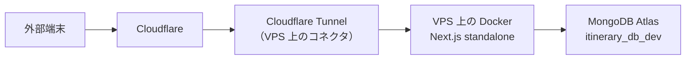

# VPS（ConoHa）でのセルフホスト試験

Vercel Hobby の無料枠超過を受けた移行先の検討。自宅ミニPC案（[poc-log.md](poc-log.md)）の代わりに、
**VPS を時間課金で試す**（当初はカゴヤを検討したが、申し込みの導線で断念し ConoHa VPS を契約）。作業ブランチは `self-host-poc`（ローカルのみ、push しない）。

> 接続文字列・トークン・IP アドレス等の**値は書かない**。どの環境変数に何を入れるかだけを記録する。

## なぜ VPS を試すか（2026-09-18）

ミニPC案の PoC で、Docker 構成・Cloudflare Tunnel・Auth0・障害復旧までは動くことを確認済み。
残る判断は「どの機械で動かすか」で、VPS は次の点でミニPCより有利:

- **費用**: 4GB プランで月1,751〜3,608円（ConoHa。カゴヤは月1,760円）。ミニPC（約7万円＋電気代）と比べると、
  **元が取れるのは4年ほど先**。それより短い期間なら VPS が安い
- **セキュリティ**: 乗っ取られても被害は VPS 内で止まる。自宅に置くと、家庭内の他の機器（PC・NAS・カメラ）に手が届く
- **自宅ネットワーク**: 停電・回線障害・工事の影響を受けない。告知で閲覧が12〜15倍になっても、家族の通信を圧迫しない
- **手間**: 機器の故障・熱・音・設置場所を考えなくてよい

ミニPCが有利なのは「4年以上使う前提の費用」と「CPU の余裕」。

## 試験で確かめること

- [ ] **1コアあたりの性能**: Next のサーバーは実質1コアで動く（[poc-log.md](poc-log.md) の手順5）。
      同じ試験（autocannon、c=1/12/50）を VPS で行い、開発PC比で何割かを測る
- [ ] **メモリ4GBで足りるか**: `next build` は最大約1GB使う。待機時は約140〜200MiB、負荷時は約690MiB まで増えた実績
- [ ] **共有 CPU の影響**: 時間帯によって性能が変わらないか（他の利用者の影響）
- [ ] **トンネル経由の速度**: 本番（Vercel）と比較。経由する Cloudflare 拠点（`colo`）も記録
- [ ] **AI 生成**: Cloudflare の応答待ち上限（約100秒）に収まるか。開発PCでは約40秒

## 構成（予定）

- **公開ホスト名は `vps.over40web.club`**（新しいトンネル `vps-trial` を作る）。
  開発PCの `staging.over40web.club` はそのまま残し、**両方を並べて比較できるようにする**
  （同じトンネルのトークンを2台で使うと、アクセスが2台に振り分けられてしまうため、必ず別トンネルにする）
- Cloudflare Access で、`vps.over40web.club` にも staging と同じ2つのポリシー（メール許可・サービストークン）を付ける
- DB は開発用 `itinerary_db_dev` のまま

## 手順

### 1. VPS の用意（ユーザー）

- ConoHa VPS を契約（4GB / 4vCPU / SSD 100GB、6.6円/時・月額上限 3,608円）
- OS は **Ubuntu 24.04 LTS**（サーバー用途の情報が多く、Docker 公式の手順がそのまま使える）
- SSH の公開鍵を登録する（パスワード認証は使わない）
- 契約後に共有してもらうもの: **IP アドレス**（チャットに貼って問題ないが、メモには書かない）と SSH の接続方法

### 2. 最低限のセキュリティ設定

- SSH: 鍵認証のみ（`PasswordAuthentication no`）、root ログイン禁止
- `ufw`: 外部からの接続は SSH のみ許可。アプリのポート（3000）は**開けない**（トンネル経由のため不要）
- `unattended-upgrades`（自動更新）を有効にする
- `fail2ban` を入れる

### 3. Docker とアプリの配置

- Docker Engine と Compose プラグインを導入
- リポジトリを配置（`self-host-poc` ブランチ）
- `.env.docker`（`APP_BASE_URL` は `https://vps.over40web.club`）と `.env.tunnel`（新トンネルのトークン）を置く
- **ビルド方法の判断**: メモリ4GB で `next build`（最大約1GB）が通るか確かめる。
  厳しければ、開発PCでビルドしたイメージを `docker save` / `docker load` で送る（イメージは約374MB）
- スワップを2GB用意しておくと、ビルド時の余裕になる

### 4. 外部サービス側の設定

- Auth0: Callback / Logout / Web Origins に `https://vps.over40web.club` を追加（既存の URL は消さない）
- Mapbox: ブラウザ用トークンの URL 制限に `https://vps.over40web.club` を追加
- MongoDB Atlas: IP アクセスリストを確認（`0.0.0.0/0` でなければ VPS の IP を追加する）

### 5. 計測と比較

- 手順5と同じ並列アクセス試験（Docker 内部ネットワークから）
- 外から（サービストークン付き）の応答時間・`colo`
- 数日動かして、時間帯による性能のばらつきを見る

## 作業ログ

### 2026-09-18

- VPS を試す方針を決定（ユーザー判断）。このメモを作成
- **契約先はカゴヤではなく ConoHa VPS（GMO）に変更**。カゴヤは会員サイトと申し込みの導線が分かれており、
  会員としてログイン済みだと申し込みフォームに進めない・認証失敗で60分ロックされる等で断念（ユーザー判断）
- ConoHa の契約内容: 4Core / 4GB / SSD 100GB、時間課金 6.6円/時（月額上限 3,608円）。ネームタグ `tns-web-staging`
  - 1か月使うなら「まとめトク」（月1,751円）の方が安いが、まず見極めるため時間課金で開始
  - **やめるときは「停止」ではなく「削除」**（停止中も課金が続く）
- OS は Ubuntu 24.04 LTS。セキュリティグループは `IPv4v6-SSH` と `default` の2つ
  （Web の 80/443 は開けない。Cloudflare Tunnel を使うため）
- OP25B（25番ポート制限）は解除申請不要。メール送信は Resend の HTTPS API 経由のため

#### SSH 接続までのつまずき

- サーバー作成時に SSH キーを登録していなかったため `Permission denied (publickey)`
- 再構築画面の「新規キー登録 → 自動生成」は ConoHa 側で鍵を作る動作。**手元の鍵を使うには「インポート」**
- インポートが完了しておらず、SSH Key 一覧が空のままだった。**先に SSH Key 一覧へ登録**してから、
  再構築で「登録済みキー」を選ぶ必要があった
- 再構築の完了後は**「起動」を押す**（自動では起動しない）
- 再構築でホスト鍵が変わるため、手元で `ssh-keygen -R <IP>` が必要

#### サーバーの実測値

| 項目 | 内容 |
| --- | --- |
| OS | Ubuntu 24.04.3 LTS（kernel 6.8） |
| CPU | Intel Xeon (Icelake) 4コア、2.0GHz |
| メモリ | 3.9GB（利用可能 約3.3GB） |
| ディスク | 99GB（使用 5.1GB） |
| スワップ | **2GB が最初から用意されている**（ビルド時の余裕になる） |

#### セキュリティ設定

- 鍵は開発PCで作った ed25519（`~/.ssh/id_ed25519_conoha`、パスフレーズなし）。
  パスフレーズを付けると、1回ごとに新しいシェルで動く自動作業から使えないため。本番に使うなら鍵を入れ替える
- 作業用ユーザー `deploy` を作成（sudo 可、自動作業のため NOPASSWD）。鍵は root からコピー
- SSH: `PasswordAuthentication no` / `KbdInteractiveAuthentication no`（`/etc/ssh/sshd_config.d/99-hardening.conf`）
- `ufw`: 受信は SSH のみ（`ufw limit 22/tcp`）、送信は許可
- `fail2ban`: sshd を監視（5回失敗で1時間の遮断）
- `unattended-upgrades`: セキュリティ更新の自動適用を有効化
- つまずき: 初回起動直後は `unattended-upgrades` が動いており、`apt` がロックで失敗する。解放を待ってから実行する

#### Docker・アプリの配置（2026-09-18）

- Docker Engine 29.8.1 / Compose v5.5.1 を公式リポジトリから導入。`deploy` を docker グループに追加
- リポジトリは `git bundle`（4.2MB）を scp で送り、VPS 上で clone（`~/apps/tns-web`、ブランチ `self-host-poc`）
- `.env.docker` は開発PCの内容から `APP_BASE_URL` を `https://vps.over40web.club` に変えて転送（権限 600）
- **VPS 上でのビルドは成功**: 214秒。**メモリは最大 3.6GB（4GB のほぼ上限）＋スワップ 1.1GB**
  - 開発PC（約110秒 / 最大約1GB）と比べて時間は約2倍、メモリはぎりぎり。**スワップ2GB があるおかげで完走している**
  - 実運用では、開発PCでビルドしたイメージを転送する方式（`docker save` / `load`）も検討する
- ビルド時に `generateStaticParams` が DB を読むので、**Atlas の IP 制限は VPS からの接続を許している**ことが確認できた
- トンネル `vps-trial` を作成し、公開ホスト名 `vps.over40web.club` → `http://app:3000`。トークンは `.env.tunnel` に置く
- Cloudflare Access は、既存のアプリケーション `staging` の宛先に `vps.over40web.club` を**追加**（ポリシーは共用）
  - 確認: トークンなし 302 / サービストークンあり 200。本番 `tabi` は 200 のまま

つまずき（記録）:

- `ufw limit 22/tcp` は「短時間に接続が集中すると弾く」設定。scp と ssh を連続実行して**自分が弾かれた**
  → `sudo ufw insert 1 allow from <自宅IP> to any port 22 proto tcp` で自宅を先頭に許可して解消。
  自宅の IP が変わったら、このルールを更新する

#### 性能の比較（2026-09-18）

並列アクセス（Docker 内部ネットワークから、autocannon、各10秒、エラーは全条件で 0件）:

| ページ | 同時数 | 開発PC（i9-12900KF） | VPS（Xeon Icelake 2.0GHz） | 比率 |
| --- | --- | --- | --- | --- |
| `/api/health` | 1 | 961 件/秒 | 433 件/秒 | 45% |
| `/api/health` | 50 | 956 件/秒（p99 66ms） | 564 件/秒（p99 113ms） | 59% |
| `/help` | 50 | 720 件/秒（p99 132ms） | 373 件/秒（p99 236ms） | 52% |
| スポット詳細 | 50 | 623 件/秒（p99 154ms） | 323 件/秒（p99 524ms） | 52% |

- **VPS は開発PCの約5〜6割**。手順5で測った「0.5コア」の条件（Intel N100 級の目安）とほぼ同じ
- ただし VPS では**負荷をかける側も同じ4コアの中で動かしている**ため、実際にはこれより良い可能性がある（悲観的な値）
- 負荷後のメモリ: アプリのコンテナ 307MiB、トンネル 17MiB、システム全体で 999MB 使用（3.9GB 中）

外から（Cloudflare 経由、サービストークン付き、5回の中央値）:

| 対象 | `/api/health` | `/` | `/shachu-haku` |
| --- | --- | --- | --- |
| 本番 Vercel | 67ms | 192ms | 183ms |
| 開発PC（staging） | 35ms | 53ms | 47ms |
| **VPS** | **41ms** | **61ms** | **65ms** |

- **外から見た体感は、VPS と開発PCでほぼ同じ**。どちらも本番 Vercel より速い
- 拠点はどちらも NRT（東京）
- 並列処理の上限は開発PCの半分だが、1件ずつの応答時間には表れない（今のアクセス数なら十分）

#### ブラウザでの確認（2026-09-18）

- Auth0（Callback / Logout / Web Origins）と Mapbox のブラウザ用トークンの URL 制限に `https://vps.over40web.club` を追加（ユーザー実施）
- ログイン成功、地図も表示。シークレットウィンドウでも問題なし
  - 最初に地名が出なかったのは、初回表示時の読み込み途中だったとみられる（設定変更なしで解消）
- **調査時の誤り（記録）**: ヘッドレスブラウザでの確認時、Cloudflare Access のサービストークンのヘッダーを
  **すべての通信に付けていた**ため、Mapbox 宛てのリクエストも拒否され、「Mapbox の URL 制限が原因」と誤って報告した。
  ヘッダーなしで本番を測ると Mapbox は17件成功・0件失敗。**Access 保護下のサイトをブラウザで自動計測するときは、
  自ドメイン宛てだけにヘッダーを付ける**こと

## 判断の材料

| 項目 | 開発PC | VPS |
| --- | --- | --- |
| `/api/health` c=50 の処理量 | 956 件/秒 | 564 件/秒 |
| `/help` c=50 の処理量 | 720 件/秒 | 373 件/秒 |
| スポット詳細 c=50 の処理量 | 623 件/秒 | 323 件/秒 |
| 待機時メモリ（アプリ） | 約140MiB | 約160MiB |
| 負荷後メモリ（アプリ） | 約690MiB | 約307MiB |
| `next build` | 約110秒 / 最大約1GB | 214秒 / 最大3.6GB＋スワップ1.1GB |
| 外からの応答（`/` 中央値） | 53ms | 61ms |
| AI 生成の所要時間 | 約40秒 | 38秒 |
